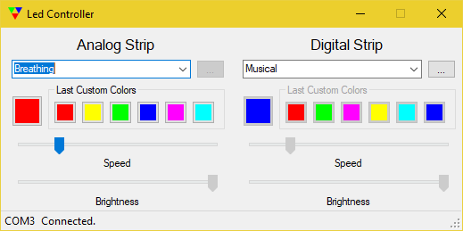
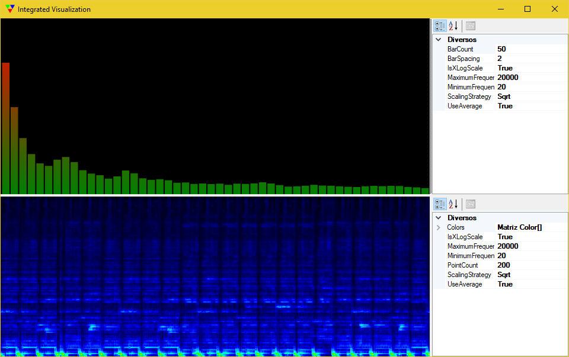
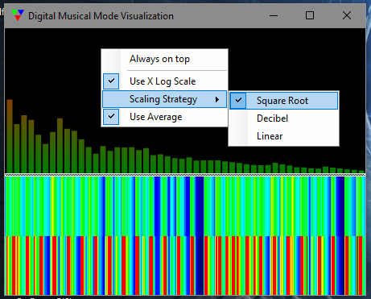
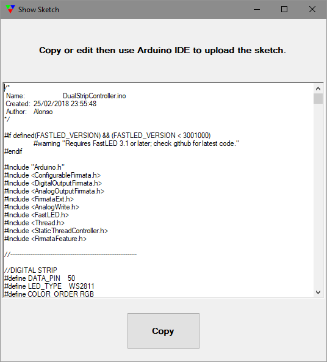
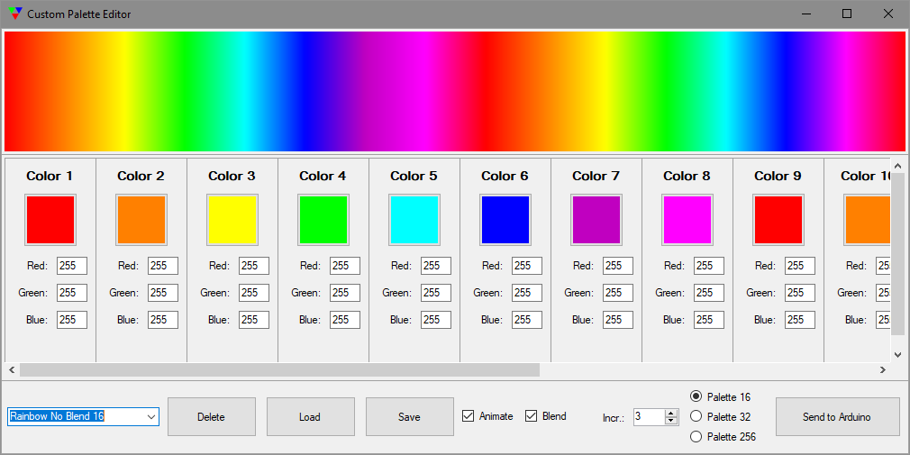

# LedsController

LEDsGUI is a simple LED strip controller designed to control two LED strips. A Digital LED strip and a Analog LED strip.
It is written in C# using windows forms for GUI interfaces. it is designed to run on systray, start with system.

In order to get the job done, you will need an Arduino MEGA or superior and communicate through serial.
The pins used can be modified on the Arduino sketch provided.

### Supported modes:

There are seven analog modes implemented and sixteen digital ones. Some of these modes can be pointed out as special. Musical modes for analog and digital strips and custom palette. Each of these modes have special configurations. The musical ones consists on rhythm leds. They are adjusted to show low frequencies sounds a.k.a *BASS Sounds*. The custom palette modes have a special GUI in order to allow you to create custom color palettes for your digital strip.   

Analog strip:
  * Real HSV Rainbow
  * Power Conscious Rainbow
  * Sine Wave Rainbow
  * Static Color
  * Breathing
  * Musical
  * Random Color
  * Deactivated

Digital strip:
  * Snake Rainbow
  * Real HSV Rainbow (Analog)
  * Power Conscious Rainbow (Analog)
  * Sine Wave Rainbow (Analog)
  * Static Color
  * Breathing
  * Musical
  * Deactivated
  * HSV Rainbow
  * HSV Rainbow Stripes
  * Cloud
  * Lava
  * Ocean
  * Forest
  * Party
  * Heat
  * Custom Pallete
  
  ### It's time for screenshots!
  
  Main Window:
  
  
  
  Visualization heavily based on [CSCore Visualization sample](https://github.com/filoe/cscore/tree/master/Samples/WinformsVisualization):
  
  
  
  Digital visualization with some options available:
  
  
  
  Window showing the used sketch:
  
  
  
  Digital Custom Palette Editor window:
  
  
    
  ### Special thanks for:
Windows side:
* [Firmata Protocol](https://github.com/firmata/protocol) used to comunicate with arduino.
  * [SolidSoils4Arduino](https://github.com/SolidSoils/Arduino) implementation of Firmata
* [CSCore](https://github.com/filoe/cscore) used for visualization and spectrum analysis
* [InnoSetup](http://www.jrsoftware.org/isinfo.php) used for installer scripting

Arduino side:
* [Configurable Firmata Protocol](https://github.com/firmata/ConfigurableFirmata) used to comunicate with Windows and control analog strip.
* [FastLED](https://github.com/FastLED/FastLED) used for controling digital strip flawlessly.
* [ArduinoThread](https://github.com/ivanseidel/ArduinoThread) used for precise control delays and do not lose serial messages.
